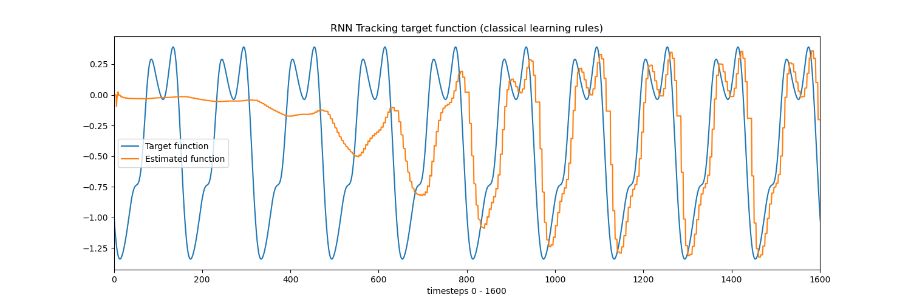

# Bayesian Synapse RNN
This repository contains an implementation of the RNN in the paper:

[**Synaptic Plasticity as Bayesian Inference** [1]](https://www.nature.com/articles/s41593-021-00809-5)  (Nature Neuroscience, 2021)


## Install 
To build the appropriate conda environment, run the following command:
```
conda env create -f environment.yml
```
To activate the environment, run:
```
conda activate bayes-rnn
```

## Run

### Classical model
To execute the classical model, run
```
python execute.py --classical
```
The target function $V_{tar}(t)$ and its corresponding network estimate $V(t)$ are plotted in 'tracking.png':



In addition, the mean squared errors at the specified validaiton steps are logged in the terminal and plotted in "mse.png".


### Bayesian Model

To run the Bayesian model, run
```
python execute.py --bayesian
```

<span style="color:red">Note:</span> The current Bayesian implementation does not converge as described in the paper. There are several potential reasons for this.

One issue is that the model is very sensitive to the initial learning rate $\eta_i(0)$. The paper reports that the initial learning rate can change performance by a factor of 30. In the Bayesian setting, $$\eta_i = \frac{\sigma_i^2}{\sigma_{\delta}^2\Delta t}$$ where $\eta$ sets the learning rate for neuron $i$, $\sigma_i^2$ is the inferred variance of synaptic weight to neuron $i$, $\sigma_\delta^2$ is the variance of the error term $\delta = V - V_{tar}$, and $\Delta t$ is the length of the time between weight updates. In this code, the initial learning rate is forced to 0.01 by setting $\sigma_i^2$ appropriately, based on the first $\sigma_\delta^2$.

Another potential issue is that the computation of $\sigma_\delta^2$ is not specified in the paper. Specifically, $\delta$ is computed by $V - V_{tar}$, where $V$ is the network estimate of the target function and $V_{tar}$ is the target function. Since the model uses online learning algorithms (i.e. the weights are updated at each timestep as the inputs come in as opposed to traditional SGD where the loss is aggregated over mini-batches before performing a weight update), the output at a specific timestep -- $V(t)$ -- along with the network estimate at a timestep -- $V_{tar}(t)$ -- are scalars. To calculate the variance of the error, this code uses a sliding window for calculating the error (over the last $x$ timesteps): 
$$\sigma_\delta^2 = \textnormal{np.var(} V_{tar}[\textnormal{e}-x:\textnormal{e}] - V[\textnormal{e}-x:\textnormal{e}]  \textnormal{)}$$

where e is the current epoch number.

## Future Work / Ideas

The current performance of the Bayesian model is sensitive to the length of the target function. Because learning happens online, the optimal learning rule / hyperparameters can depend heavily length of the target function (this is the case for RLS/FORCE [2] as well). It would be preferable -- and a compelling research direction -- to derive and test more robust learning rules (for example, to demonstrate better performance on longer target functions).

A follow-up work [3] showed that in neural networks with trainable stochastic synapses, lower synaptic variability correlates with higher firing rates and lower learning rates, consistent with experimental data [3]. To discern if the brain is Bayesian (or if it only appears so, because it is energy efficient), one must test if downstream brain areas use or ignore information about synaptic uncertainty. One potential research direction would be to hierarchically augment these Bayesian models and to compare the downstream activity in the classical models against the Bayesian models. This would address whether synaptic uncertainty from lower levels does indeed inform neural activity in higher layers (and vice versa), in line with Friston's free-energy principle [4].

In addition, it may be interesting to explore augmentations of the model type as in [3] on more complex tasks beyond simple image classification.
 
## References

[1] Aitchison, L., Jegminat, J., Menendez, J.A. et al. Synaptic plasticity as Bayesian inference. Nature Neuroscience (2021)

[2] Sussillo D, Abbott LF. Generating coherent patterns of activity from chaotic neural networks. Neuron (2009)

[3] Malkin, J., O'Donnell, C., Houghton, C., et al. Signatures of Bayesian inference emerge from energy efficient synapses. arXiv preprint (2023)

[4] Friston, K.J., 2005. A theory of cortical responses. Philos. Trans. R Soc. Lond. B Biol. Sci. 